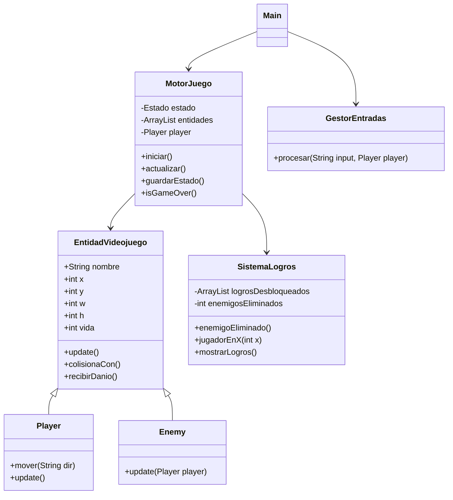
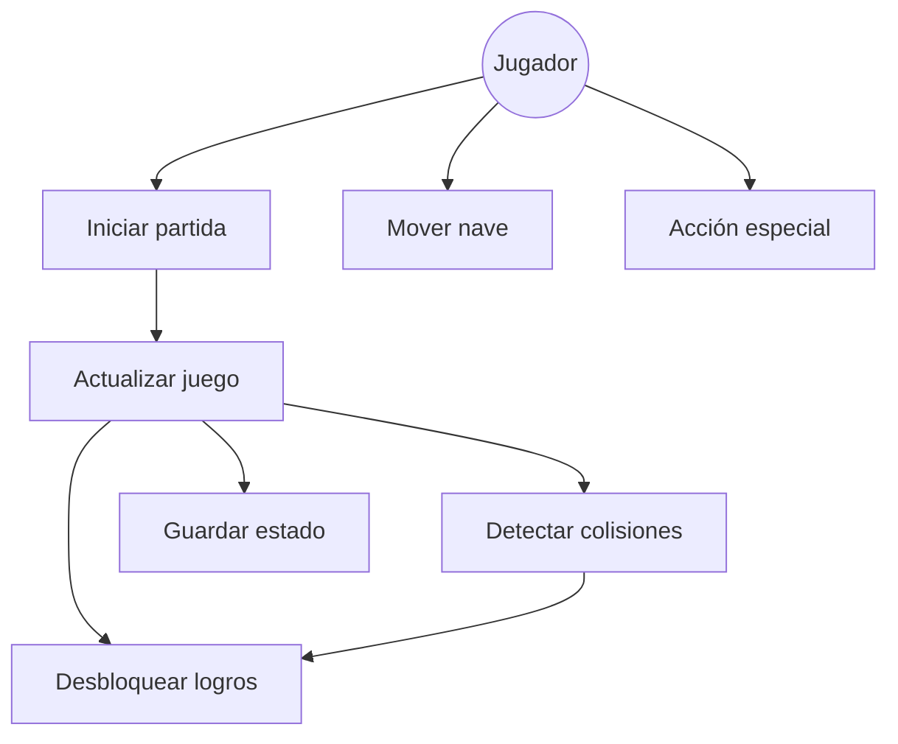

# 🚀 SPACE GRID ENGINE

---

## 🎮 Temática del videojuego

Este proyecto simula un **motor básico de videojuego 2D tipo cuadrícula**, donde el jugador controla una nave espacial que debe moverse, evitar enemigos y sobrevivir el mayor tiempo posible.

El objetivo no es construir un videojuego completo, sino diseñar un **motor de lógica interna** con:

- Arquitectura orientada a objetos
- Control de estados
- Colisiones
- Sistema de eventos (logros)

---

# 🧠 Arquitectura del Software

El sistema se ha diseñado con una arquitectura modular y mínima (máx. 6 clases).

---

## 🧩 Clases principales

### Main
- Punto de entrada del programa
- Simula inputs del usuario por consola

### MotorJuego
- Controlador principal del juego
- Gestiona estados:
  - MENU
  - JUGANDO
  - PAUSA
  - GAME OVER
- Maneja entidades y game loop

### EntidadVideojuego (abstracta)
- Clase base de todos los objetos del juego
- Atributos:
  - x, y, w, h
  - nombre
  - vida
- Lógica de colisión AABB

### Player
- Representa al jugador (nave espacial)
- Movimiento mediante inputs

### Enemy
- NPC con IA básica de persecución

### GestorEntradas
- Procesa comandos del jugador

### SistemaLogros
- Gestiona eventos y logros desbloqueados

---

# 📊 Diagrama de Clases UML

# 📌 Casos de uso

---

## 📌 Diagrama de Casos de Uso

# 🧾 Casos de uso

---

## 🧾 CU-01 Iniciar partida

| Campo | Descripción |
|------|-------------|
| **Nombre** | CU-01 Iniciar partida |
| **Objetivo** | Iniciar una nueva partida |
| **Actor principal** | Jugador |
| **Precondiciones** | Sistema en estado MENU |
| **Flujo principal** | 1. Ejecutar programa 2. Cambiar a JUGANDO 3. Crear entidades |
| **Flujos alternativos** | Si ya está en juego, no reinicia |
| **Postcondiciones** | Juego en estado activo |
| **Reglas de negocio** | No puede haber dos partidas simultáneas |

---

## 🧾 CU-02 Mover nave

| Campo | Descripción |
|------|-------------|
| **Nombre** | CU-02 Mover nave |
| **Objetivo** | Mover al jugador en la cuadrícula |
| **Actor principal** | Jugador |
| **Precondiciones** | Estado JUGANDO |
| **Flujo principal** | 1. Introducir comando 2. Procesar input 3. Actualizar posición |
| **Flujos alternativos** | Comando inválido → ignorado |
| **Postcondiciones** | Nueva posición del jugador |
| **Reglas de negocio** | No salir del mapa |

---

# 🤖 Bitácora de uso de IA

## 🛠 Herramienta utilizada
ChatGPT (OpenAI)

---

## 💬 Prompts utilizados

### Prompt 1
> Diseña un motor de videojuego en Java con máximo 6 clases, colisiones y enemigos

### Prompt 2
> Añade sistema de logros sin superar el límite de clases

---

## ⚠️ Errores de la IA

- Sobreingeniería inicial (demasiadas clases)
- Separación innecesaria de lógica
- Complejidad excesiva para el proyecto

---

## ✔ Correcciones aplicadas

- Reducción a máximo 6 clases
- Integración de lógica en MotorJuego
- Simplificación del sistema de logros
- Optimización de colisiones

---

# 🧠 Reflexión crítica

El uso de inteligencia artificial permite acelerar el desarrollo de software, especialmente en:

- Diseño de arquitectura
- Generación de código base
- Documentación técnica

Sin embargo, también presenta riesgos:

- Sobreingeniería
- Diseños demasiado complejos
- Dependencia excesiva del modelo

Por ello, es necesario combinar IA con criterio de diseño propio.

---

# 🏁 Conclusión

Este proyecto demuestra:

- Programación orientada a objetos
- Gestión de estados
- Colisiones AABB
- IA simple de enemigos
- Sistema de logros
- Uso responsable de inteligencia artificial en desarrollo